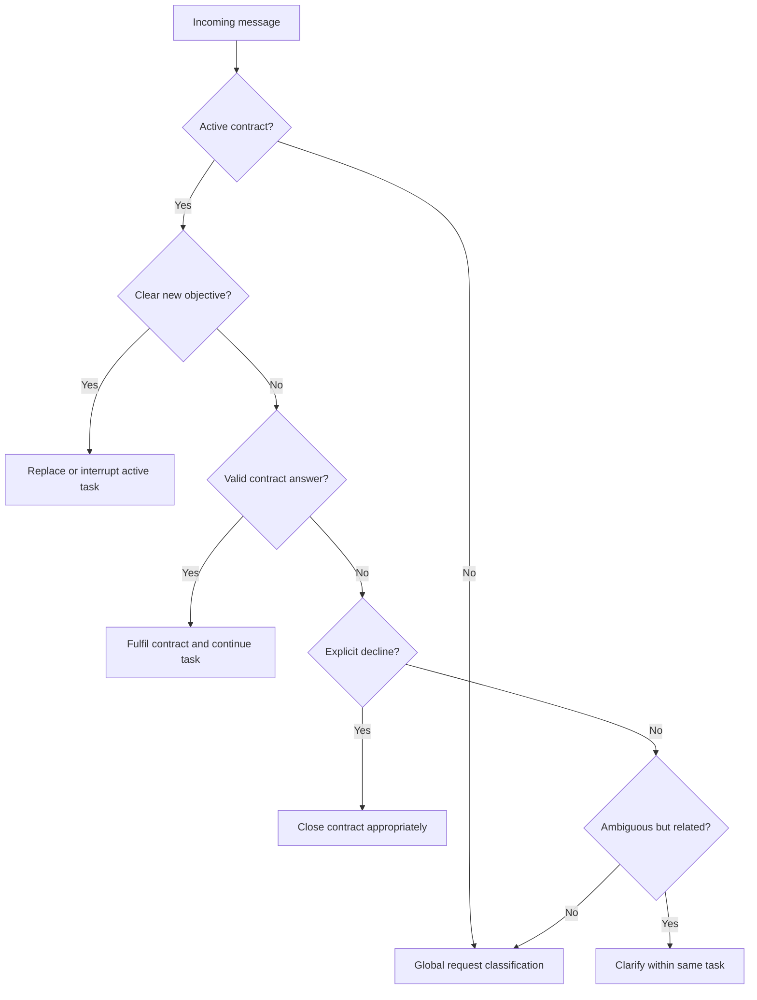

# SIT Conversation Contract: Architecture Review

## Document Status

- Audience: CTO, founders, product architecture, AI engineering
- Review date: 28 July 2026
- Scope: Relationship between the Active Conversation Task and explicit response expectations
- Purpose: Determine whether Conversation Contract should be a separate architectural abstraction
- Change policy: This is an architecture review. It does not modify product philosophy or prescribe implementation details.

## Executive Verdict

The Conversation Contract is a valid and necessary concept, but it should not become a separate top-level state machine.

It should be a first-class object owned by the **Active Conversation Task**.

The architectural responsibilities are:

- **Active Conversation Task:** What is SIT helping the traveler accomplish?
- **Conversation Contract:** What response is SIT currently waiting for?
- **Memory:** What does SIT already know?
- **Conversation Orchestrator:** Which transition happens next?

## Is This Already Represented?

Partially.

The Active Conversation Task proposal already includes:

- pending clarification
- expected answer type
- unresolved entity
- task mode
- task status

However, it does not state the strongest invariant introduced by Conversation Contract:

> When SIT asks for information, the question must create a machine-readable expectation that governs interpretation of the next user turn.

That principle deserves an explicit architectural name.

Without it, `pendingClarification` risks becoming another optional memory field. A Conversation Contract makes it a turn-taking obligation.

## Recommended Relationship

```text
Conversation Session
└── Active Conversation Task
    ├── Objective
    ├── Mode
    ├── Constraints
    ├── Status
    ├── Evidence
    └── Active Conversation Contract
        ├── Expected response
        ├── Reason
        ├── Fulfillment rules
        └── Interruption policy
```

The contract must belong to the task because its meaning comes from that task.

`Arcana` means a venue only because the active location task asked for a venue. Without the task, the contract has no context.

## Important Challenge

The rule should not literally be:

> Whenever SIT asks any question, create a blocking contract.

Not every question has the same conversational meaning.

### Blocking Questions

These require an answer before the active task can continue:

- Which venue?
- Which date?
- Which area?
- Which of these two events?
- What do you mean by "nearby"?

These create a blocking Conversation Contract.

### Optional Questions

These invite refinement but do not block anything:

- Would you like me to narrow these down?
- Are you also open to conscious music events?
- Want another option for tomorrow?

These should not capture the next message automatically. They are optional offers, not unresolved requirements.

### Discovery Questions

These create contracts only when Discovery is already eligible inside a Decision task:

- Are you looking for something relaxing or social?
- Do you have a scooter?
- Are you going alone or with friends?

An unfinished onboarding question must never remain as a hidden contract after the user switches to Information Mode.

## Contract Lifecycle

A contract should remain active until one of five outcomes occurs:

1. **Fulfilled**

   The answer satisfies the expected slot.

2. **Declined**

   The user says they do not know, do not care, or do not want to answer.

3. **Clarified again**

   The answer remains ambiguous and SIT asks a narrower question.

4. **Superseded**

   The user clearly starts a new task.

5. **Task completed or abandoned**

   The parent task no longer exists, so its contract cannot survive.

A contract must never continue independently after its parent task has been replaced.

## Routing Order

The proposed "contract before global intent" rule is directionally correct, but it should not blindly consume every message.

The orchestrator should evaluate both:

- Can this message reasonably fulfil the active contract?
- Does it clearly express a new immediate objective?



### Routing Examples

| Active contract | User message | Result |
| --- | --- | --- |
| Venue name | `Arcana` | Fulfil venue contract |
| Date | `Tomorrow` | Fulfil date contract |
| Area | `Sri Thanu` | Fulfil area contract |
| Age | `Where is Arcana?` | New Information task overrides Discovery |
| Venue name | `I don't know` | Decline contract |
| Venue name | `Maybe the one in Sri Thanu` | Clarify within the same task |

## Architectural Invariants

The architecture should enforce:

1. SIT cannot issue a blocking question without creating a Conversation Contract.
2. Customer-facing text cannot create contracts by itself.
3. Only the Conversation Orchestrator creates, fulfils, replaces, or closes contracts.
4. Only one blocking contract may be active for a task at a time.
5. A contract cannot outlive its parent task.
6. A clear direct request may supersede a contract.
7. Information requests always override Discovery contracts.
8. Optional offers must not behave as blocking contracts.
9. Contract answers are interpreted before unrelated global fallback behavior.
10. Onboarding cannot resume merely because a contract ended.

## Why This Is Not Duplication

The Active Conversation Task and Conversation Contract solve different continuity problems.

### Active Conversation Task

Preserves objective continuity:

```text
What are we doing?
```

It owns the user's objective, mode, explicit constraints, lifecycle, evidence, and result context.

### Conversation Contract

Preserves turn continuity:

```text
What are we waiting for right now?
```

It owns the expected response, fulfillment conditions, and interruption behavior created by a specific SIT question.

The contract is therefore not a competing owner. It is a temporary obligation within the lifecycle of its parent task.

## Architectural Risk If Separated

Making Conversation Contract an independent workflow would recreate the ownership ambiguity the Active Conversation Task is intended to remove.

An independent contract engine could:

- survive after its original task is replaced
- compete with current intent for routing priority
- maintain a second lifecycle beside the task lifecycle
- queue old Discovery questions after Information requests
- create uncertainty over which component may close or replace the contract

For these reasons, the contract should never exist without a parent task and should never transition independently of the Conversation Orchestrator.

## Architectural Risk If Omitted

Leaving the concept implicit would allow the current failure class to continue:

- SIT asks a question only through customer-facing text.
- No expected response is stored.
- The next short answer is classified globally.
- The active task loses continuity.
- Legacy onboarding or an unrelated fallback handles the answer.

The Arcana failure is one example, but the same issue applies to venue, date, area, price, event identity, reservation details, and Discovery answers.

## Final Recommendation

Add **Conversation Contract** as an explicit architectural concept, but make it a first-class child of the Active Conversation Task.

It simplifies the architecture by replacing implicit follow-up interpretation with an enforceable rule:

```text
Active Conversation Task
= What are we doing?

Conversation Contract
= What are we waiting for right now?
```

This separation provides clear ownership without creating a competing workflow.

The concept becomes harmful only if:

- it is implemented as an independent state machine
- it can outlive its parent task
- every conversational question is treated as blocking
- it is allowed to override a clear new user objective

The recommended architecture is therefore:

```text
One Conversation Orchestrator
  owns one Active Conversation Task
    which may own one blocking Conversation Contract
```

This gives SIT both objective continuity and turn continuity while preserving the rule that the traveler's latest explicit need has priority.
