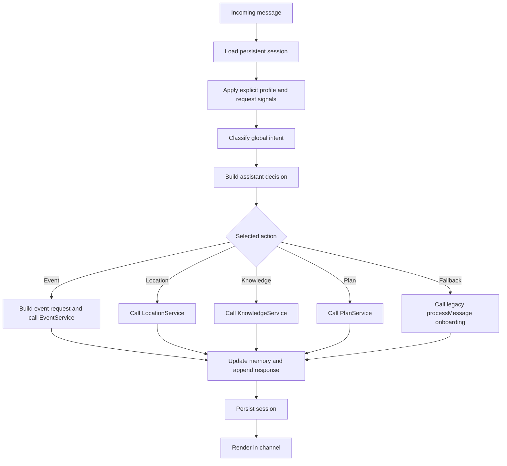
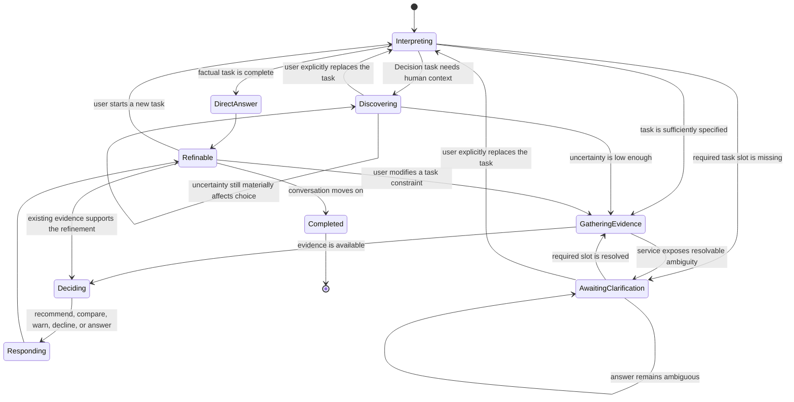

# SIT Decision Process: CTO Architecture Review

## Document Status

- Audience: CTO, founders, product architecture, AI engineering
- Review date: 28 July 2026
- Scope: Current conversation and decision process across Web and WhatsApp
- Purpose: Explain how SIT currently reaches a response, identify the architectural gap behind recent conversation failures, and define the smallest corrective direction
- Change policy: This document reviews the existing system. It does not introduce new product philosophy or prescribe feature work.

## Executive Summary

SIT has made meaningful architectural progress. Web and WhatsApp use the same server-side session model, the same conversation runner, and the same service interfaces. Time windows, event filtering, knowledge retrieval, venue lookup, and onboarding are no longer owned by channel-specific UI code.

However, the system is not yet operating as one coherent decision process.

The core problem is not intent detection alone. The missing abstraction is a first-class **Active Conversation Task** that owns the user's current objective from the moment it is understood until it is answered, refined, replaced, or abandoned.

Today, SIT stores several fragments of task context:

- onboarding progress
- event request context
- last event
- last venue
- follow-up hints
- traveler profile

What it does not store consistently is:

- what the user is currently trying to accomplish
- whether that task is resolved or awaiting clarification
- which answer the system is waiting for
- which constraints belong to the task and must be inherited
- whether Discovery is eligible for this task

As a result, a service can ask a clarification question in plain assistant text without creating a corresponding state transition. The next user message then appears to the router as an unrelated new message. If it does not match a global intent, the runner falls into legacy onboarding.

This is why a conversation can move from:

```text
Where is Arcana?
```

to:

```text
Which place do you want the pin for?
```

and then interpret:

```text
Arcana
```

as permission to continue onboarding.

The smallest architectural correction is to make the active task and its clarification state explicit, route all replies through that task before global classification, and restrict Discovery to an explicit Decision task. This correction would address the full class of continuity failures instead of adding more phrase-level guards.

## Product Authority

This review applies the responsibilities established by the three permanent product documents:

- `THE_SIT_MIND.md` defines why SIT exists: trustworthy local decision-making.
- `DISCOVERY_ENGINE.md` defines how SIT understands people: optional, progressive uncertainty reduction.
- `DECISION_ENGINE.md` defines how SIT helps people decide: contextual judgment supported by knowledge.

The current implementation should therefore preserve the following authority boundaries:

```text
Conversation Orchestrator
  determines the user's current objective and mode

Discovery
  reduces uncertainty only when judgment requires it

Decision
  chooses, compares, warns, or declines

Knowledge and services
  provide evidence and factual capabilities

Channel adapters
  transport and render the result
```

## Current Production Flow

The current Web flow is:

```text
chat.tsx
  -> conversation-api.ts
  -> POST /api/conversation/turn
  -> runConversationTurn()
  -> service or onboarding response
  -> session persistence
  -> Web rendering
```

The current WhatsApp flow is:

```text
WhatsApp webhook
  -> session load
  -> runConversationTurn()
  -> service or onboarding response
  -> session persistence
  -> WhatsApp rendering
```

Both channels therefore share the same top-level production runner. A normal Web or WhatsApp turn does not use a separate channel-specific conversation engine.

### Main Runtime Components

| Responsibility | Current owner |
| --- | --- |
| Web input and rendering | `artifacts/sit-demo/src/pages/chat.tsx` |
| Web API adapter | `artifacts/sit-demo/src/lib/conversation-api.ts` |
| Conversation HTTP route | `artifacts/api-server/src/routes/conversation.ts` |
| WhatsApp adapter | `artifacts/api-server/src/routes/whatsapp.ts` |
| Canonical turn runner | `lib/sit-engine/src/conversation.ts`, `runConversationTurn()` |
| Intent classification | `lib/sit-engine/src/intent-router.ts` |
| Event request continuity | `lib/sit-engine/src/conversation.ts` and event utilities |
| Venue matching and location copy | `lib/sit-engine/src/venues.ts` |
| Service interfaces and adapters | `lib/sit-engine/src/services.ts` |
| Persistent session ownership | `artifacts/api-server/src/repositories/session-repository.ts` |
| Developer traces | `artifacts/api-server/src/services/developer-console.ts` |
| Legacy onboarding workflow | `lib/sit-engine/src/conversation.ts`, `processMessage()` |

## Current Decision Lifecycle

For each incoming message, the runner currently performs a sequence broadly equivalent to:



This flow centralizes execution, but it does not centralize the lifecycle of the user's task.

## What Is Working Well

### One Cross-Channel Entry Point

`runConversationTurn()` is used by both Web and WhatsApp. A correction inside the runner can improve both channels without duplicating product behavior in their adapters.

### Server-Side Session Persistence

Conversation state is loaded and persisted by the backend. Follow-up behavior is no longer dependent on a single browser component or an in-memory WhatsApp-only map.

### Service Boundaries

Events, knowledge, locations, and plans are exposed behind shared service contracts. This is the correct foundation for channel-neutral product behavior.

### Explicit Request Context For Events

The engine now preserves meaningful event constraints such as date, category, area, and previous result context. Refinements such as `Only wellness`, `Only Sri Thanu`, and `Tomorrow instead` can modify a previous event task rather than rebuilding it blindly.

### Destination-Aware Time

Event time resolution is based on the destination timezone rather than the browser timezone. This aligns time-based decisions with local reality.

### Internal Observability

The Developer Console already exposes intent, memory, service use, knowledge retrieval, state changes, and event diagnostics. The system has a strong base for inspecting future task transitions.

## The Architectural Gap

### Missing Abstraction: Active Conversation Task

The system needs one explicit object that represents the current user objective and owns its lifecycle.

The best name is **Active Conversation Task**, not simply Conversation State or Pending User Request.

`ConversationState` is too broad: it includes history, profile, onboarding, and channel concerns.

`PendingUserRequest` is too narrow: a task remains relevant after a service call, during clarification, during refinement, and while presenting a recommendation.

`Conversation Orchestrator` is the owner, not the state being owned.

`Active Recommendation Context` applies only after a recommendation exists and cannot represent factual information tasks.

The Active Conversation Task should conceptually answer:

- What is the user trying to accomplish right now?
- Is this Information Mode or Decision Mode?
- What constraints did the user explicitly set?
- Which constraints were inferred or added by Discovery?
- What stage is the task in?
- Is the system awaiting a specific answer?
- Which service result belongs to this task?
- Is the task complete, refinable, replaced, or abandoned?

### Why Existing State Is Insufficient

The repository currently stores multiple partial representations of task state, including event-specific original requests, last event context, last topic, pending event follow-up, onboarding stage, and current mode.

These fields solve individual cases, but no single owner enforces their relationship. A location clarification cannot use the event-specific continuity model. A service-generated question does not automatically become a pending conversational obligation. A bare reply such as `Arcana` is therefore classified globally instead of within the task that asked for it.

## Root Cause Investigation

### Reproduced Conversation

The following runtime path was reproduced with a fresh persistent session.

#### Turn 1

User:

```text
Hi SIT, I am Maya, I want to know what wellness events are going on today.
```

Resolved behavior:

| Field | Value |
| --- | --- |
| Intent | `live_event_search` |
| Mode | Information |
| Action | `call_live_events` |
| Service | EventService |
| Time boundary | Today |
| Category boundary | Wellness |
| Onboarding | Suppressed |
| Result | Today's wellness events only |

State after the response correctly includes Maya's name, the wellness category, today's event window, and the active event result context. Onboarding remains incomplete but is not allowed to override this direct request.

#### Turn 2

User:

```text
Where is Arcana location?
```

Resolved behavior:

| Field | Value |
| --- | --- |
| Intent | `location_request` |
| Mode | Information |
| Action | `resolve_location` |
| Service | LocationService |
| Venue match | None |
| Response | `Which place do you want the pin for?` |

Arcana is not present in the static venue registry. The location path therefore emits a generic clarification sentence.

The critical failure occurs here: the response does not create a structured pending clarification. No state records that SIT is waiting for a venue name as part of a location task.

#### Turn 3

User:

```text
Arcana
```

Resolved behavior:

| Field | Value |
| --- | --- |
| Venue extraction | No match |
| Global intent | `general_chat` |
| Default action | `continue_onboarding` |
| Response generator | `processMessage()` |
| Profile state | Name known, age unknown |
| Response | `Nice to meet you, Maya. Roughly how old are you?` |

The age question is generated by the legacy onboarding sequence because `general_chat` is currently mapped to `continue_onboarding`. The runner does not know that `Arcana` is the answer to its own immediately preceding clarification question.

### Single Root Cause

SIT asks conversational questions through opaque assistant text without storing the obligation created by the question.

In other words, the response layer can create a follow-up, but the state model does not own that follow-up. On the next turn, global intent classification sees only the new text and loses the local meaning created by the previous assistant message.

This is the single root cause of the reproduced failure.

Adding Arcana to the venue database would hide this example but would not correct the architecture. The same failure would recur for any unknown venue, ambiguous event, missing date, unclear area, incomplete reservation question, or other service clarification.

## One Runner, Multiple Internal Workflows

The production system has one canonical runner, but several internal workflows still make independent transition decisions:

1. Intent and action routing
2. Event search and event refinement
3. Location resolution
4. Knowledge retrieval
5. Planning
6. Legacy onboarding and Discovery

These workflows do not run concurrently in a single turn. The issue is that they do not share one complete task lifecycle.

The most significant overlap is the legacy `processMessage()` workflow. It does not bypass the canonical runner from outside. Instead, the runner invokes it as the default path when no direct intent is recognized. This makes incomplete onboarding a global fallback rather than an explicitly eligible stage of a Decision task.

## State Ownership Review

| State concept | Current condition | Ownership risk |
| --- | --- | --- |
| Current user objective | Partially inferred each turn | No durable owner |
| Information vs Decision Mode | Represented indirectly and in memory | Not enforced as a task invariant |
| Discovery eligibility | Inferred from fallback behavior | Not modeled explicitly |
| Onboarding progress | Shared between runner context and `processMessage()` | Multiple transition points |
| Pending event request | Modeled for events | Domain-specific, not reusable |
| Pending clarification | Not modeled generally | Missing owner |
| Explicit date and category | Stored in event request context | Strong within event flow only |
| Active venue | Derived by service, memory, or text parsing | Ambiguous ownership |
| Active result set | Strongest for events | Inconsistent across services |
| Traveler profile | Updated through explicit parsing and onboarding | Several mutation paths |
| Journey context | Present in philosophy, not a runtime decision input | Intentionally incomplete |
| Recommendation rationale | Partially visible in traces | Not yet a distinct Decision output |

## Alignment With SIT Philosophy

### Information Mode

**Current alignment: 72/100**

Direct factual requests usually bypass onboarding and call the correct service. Explicit event category and time boundaries are now respected. However, Information Mode is not durable across unresolved clarification. A factual exchange can still fall into Discovery when the next reply is short or unclassifiable globally.

### Discovery

**Current alignment: 48/100**

Discovery has useful branching and profile memory, but it remains structurally coupled to legacy onboarding. Because `general_chat` defaults to `continue_onboarding`, Discovery can become eligible because classification failed, not because additional human context would materially improve a decision.

### Decision

**Current alignment: 40/100**

The engine contains decision rules for explicit filters, primary event experience, local time, and some follow-up handling. It does not yet expose Decision as a complete, independent stage that receives a resolved need, current state, constraints, knowledge evidence, uncertainty, and journey context before choosing an outcome.

Much of the current path remains:

```text
Intent -> Service retrieval -> Formatted response
```

rather than:

```text
Intent and task -> Optional Discovery -> Evidence -> Decision -> Response
```

### Knowledge

**Current alignment: 65/100**

Knowledge is canonical and server-side, with retrieval provenance. It can support both channels consistently. In many response paths, however, retrieval still produces the answer directly instead of supplying evidence to an explicit Decision stage.

### Memory and Journey

**Current alignment: 45/100**

The system remembers useful profile and event context across requests. It does not yet have a general memory model for completed experiences, recommendation outcomes, or natural next steps in a traveler's journey. This does not block the immediate correction, but it limits the long-term product model.

### Overall Decision Process Alignment

**Current score: 54/100**

The foundations are substantially better than a channel-specific chatbot, but the system is still transitioning from shared routing and retrieval into a true local decision engine.

## Target Conversation State Model

The target model should separate long-lived session memory from the lifecycle of the current task.

### 1. Conversation Context

Owns channel-neutral session facts:

- session identity
- channel
- conversation history
- last activity
- state version
- active task reference

### 2. Traveler Context

Owns durable and revisable understanding of the person:

- known profile information
- stable decision variables
- recent dynamic state
- destination experience
- journey stage

This context enriches a task. It does not replace the user's explicit request.

### 3. Active Conversation Task

Owns the user's current objective:

- task type
- mode: Information or Decision
- original request
- immutable explicit constraints
- mutable refinements
- task status
- Discovery eligibility
- pending clarification
- evidence and service results
- decision outcome

### 4. Result Context

Owns the output that follow-ups can refine:

- selected entities
- ordered candidates
- applied filters
- rejected candidates
- source version and timestamps
- unresolved uncertainty

### 5. Journey Context

Owns continuity beyond the current task:

- prior recommendations
- traveler feedback
- successful or unsuccessful experiences
- natural next-step signals

Journey should be architecturally recognized now, while fuller implementation can remain a later phase.

## Active Task Lifecycle



## Immutable And Mutable Context

### Immutable Unless The User Changes It

The following task facts should survive Discovery, service calls, and clarification:

- the original user objective
- explicit mode implied by the objective
- explicit date or time window
- explicit category
- explicit area
- explicit audience or group constraint
- explicit price or mobility constraint
- task identity

For example, `today's wellness events` must remain `today + wellness` throughout the task. Discovery may add energy, mobility, or wellness preference, but it cannot erase the original date or broaden the category.

### Mutable Through Enrichment

The following may be added or revised without replacing the task:

- inferred human need
- current state
- relevant decision variables
- clarification answers
- preferred subcategory
- result ordering
- service evidence
- uncertainty
- recommendation rationale

### Mutable Only Through Explicit User Change

The following changes should be treated as direct task modifications:

- `Tomorrow instead`
- `Only Sri Thanu`
- `After 6pm`
- `Only free`
- `Show me everything`

The orchestrator should update the named dimension and inherit every unaffected constraint.

## Transition Rules

### Continue The Active Task

Continue when the message:

- answers the clarification SIT just asked
- narrows or broadens a current constraint
- refers to an entity in the active result
- asks for a factual attribute of the active entity
- compares current candidates

### Modify The Active Task

Modify when the user explicitly changes one dimension while preserving the objective.

Examples:

- `Only wellness` changes category.
- `Only free` changes price.
- `Only Sri Thanu` changes area.
- `After 6pm` changes the time boundary.
- `Tomorrow instead` changes the date.

### Restart With A New Task

Restart only when the user expresses a new objective that cannot reasonably be interpreted as a refinement or answer to the current task.

The new explicit objective takes priority immediately. Incomplete Discovery must not be queued for automatic resumption.

### Enter Discovery

Discovery is eligible only when:

- the active task is a Decision task
- unresolved human context would materially change the recommendation
- the answer is not already present in the current request, active conversation, or traveler memory

Classification failure is not a reason to enter Discovery.

### Await Clarification

Whenever SIT asks the user for missing task information, the orchestrator must store:

- the active task
- the expected answer type or slot
- the reason the answer is required
- any unresolved entity text or candidate list
- the mode that must remain active

The next message should first be interpreted against this expected answer. Global intent classification should run only if the user clearly replaces the task or the clarification cannot consume the reply.

## How The Model Prevents Observed Failures

| Observed failure | Prevention |
| --- | --- |
| Discovery erases `today + wellness` | Explicit task constraints are immutable until the user changes them. |
| `Only wellness` starts a new search with lost context | The phrase modifies one dimension of the active task and inherits date, area, and mode. |
| A follow-up changes Today to Tomorrow unexpectedly | Date is inherited from the active task unless explicitly replaced. |
| Onboarding becomes the task | Discovery is a state inside an eligible Decision task, never a global fallback. |
| Information Mode resumes onboarding | Information is a task invariant until the task completes or the user replaces it. |
| `Arcana` is treated as unrelated chat | The active location task is awaiting a venue slot, so `Arcana` is consumed as that answer first. |
| Service clarification disappears from memory | Structured service outcomes create explicit `AwaitingClarification` state. |
| Web and WhatsApp diverge | Both channels persist and render the same runner output and active task state. |

## Smallest Architectural Correction

The recommended correction is deliberately limited. It does not require a new UI, vector search, a new event provider, or a broad Decision Engine implementation.

### Step 1: Add A General Active Task Contract

Introduce a channel-neutral task state capable of representing Information and Decision objectives, explicit constraints, lifecycle status, and pending clarification.

### Step 2: Make Service Outcomes Structured

Services should return outcomes such as:

- resolved
- not found
- needs clarification
- ambiguous candidates
- unavailable

A service may provide suggested customer-facing wording, but it must not create an untracked conversational question through text alone.

### Step 3: Resolve Pending Clarification Before Global Intent

At the beginning of every turn, the orchestrator should determine whether the message answers an expected slot in the active task. A clear new request can replace the task; otherwise the clarification context has priority over global classification.

### Step 4: Remove Onboarding As The Global Fallback

`processMessage()` should run only when an explicit Decision task has made Discovery eligible. General chat and failed classification should have their own neutral behavior and must not imply permission to continue onboarding.

### Step 5: Centralize Task Transitions In The Runner

Services should report facts and outcomes. Adapters should render. Only the canonical runner should create, modify, suspend, complete, or replace an active task.

## Required Regression Tests

The correction should not be accepted without the following cross-channel tests:

1. Exact Maya wellness and Arcana three-turn reproduction.
2. Unknown venue clarification followed by a bare venue name.
3. Pending clarification survives session persistence and reload.
4. A sequence of factual questions never enters Discovery.
5. An incomplete traveler profile does not make Discovery eligible.
6. Every assistant clarification creates an expected-answer state.
7. Service text cannot independently create a follow-up obligation.
8. Web and WhatsApp produce equivalent task transitions and core responses.
9. An explicit judgment request can enter Discovery when uncertainty matters.
10. Information Mode plus an unresolved active task can never transition to onboarding.
11. A clear new user objective replaces the unresolved task immediately.
12. Task refinements inherit all constraints the user did not change.

## MVP Risk Assessment

### Blocking

- No general active task lifecycle
- No first-class pending clarification state
- Discovery/onboarding used as a default fallback
- Service-generated clarification questions are not represented in state
- Information vs Decision Mode is not enforced across a complete multi-turn task

These issues directly affect trust because SIT can appear not to listen, forget explicit constraints, or ask irrelevant personal questions during factual exchanges.

### Important But Not Blocking This Correction

- Full judgment stage separated from retrieval
- Journey-based recommendation continuity
- Memory of successful and unsuccessful experiences
- Broader venue coverage
- More advanced uncertainty and evidence evaluation
- Richer human need and current-state representation

These should remain visible in the architecture but should not expand the scope of the immediate task continuity correction.

## Recommended Delivery Sequence

### Immediate: Conversation Task Integrity

Implement the Active Conversation Task, pending clarification, structured service outcomes, and explicit Discovery eligibility. Preserve current UI and service providers.

### Next: Explicit Decision Stage

Separate evidence retrieval from judgment. Produce structured Decision outcomes that explain internally why an option was selected, compared, warned against, or declined.

### Later: Journey And Trust Learning

Track experience outcomes and traveler feedback so future decisions can build on what SIT previously got right or wrong.

## CTO Decision Requested

Approve the following architectural direction before further conversation bug fixes:

1. Treat the Active Conversation Task as the single owner of the user's current objective.
2. Make Information and Decision Mode properties of that task, not temporary routing labels.
3. Make clarification a stored state transition, not assistant copy.
4. Allow Discovery only inside an explicit Decision task.
5. Keep `runConversationTurn()` as the one cross-channel transition authority.
6. Defer broader Decision and Journey intelligence until task continuity is reliable.

## Conclusion

SIT does not currently suffer from multiple channel-specific engines. It suffers from multiple partial workflow models inside one runner.

The runner is canonical, but the user's objective is not yet canonical.

Once the Active Conversation Task becomes the durable center of the decision process, intent, Discovery, services, knowledge, recommendations, follow-ups, and memory can operate as stages of one coherent lifecycle. That is the smallest correction that addresses the observed failures at their source and creates a stable foundation for SIT to become the decision engine described by its product philosophy.
